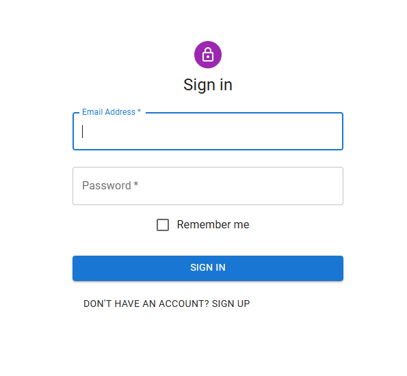
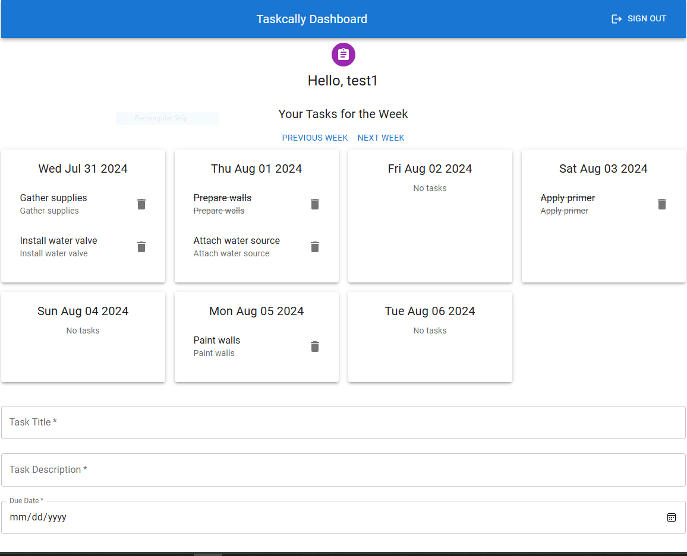
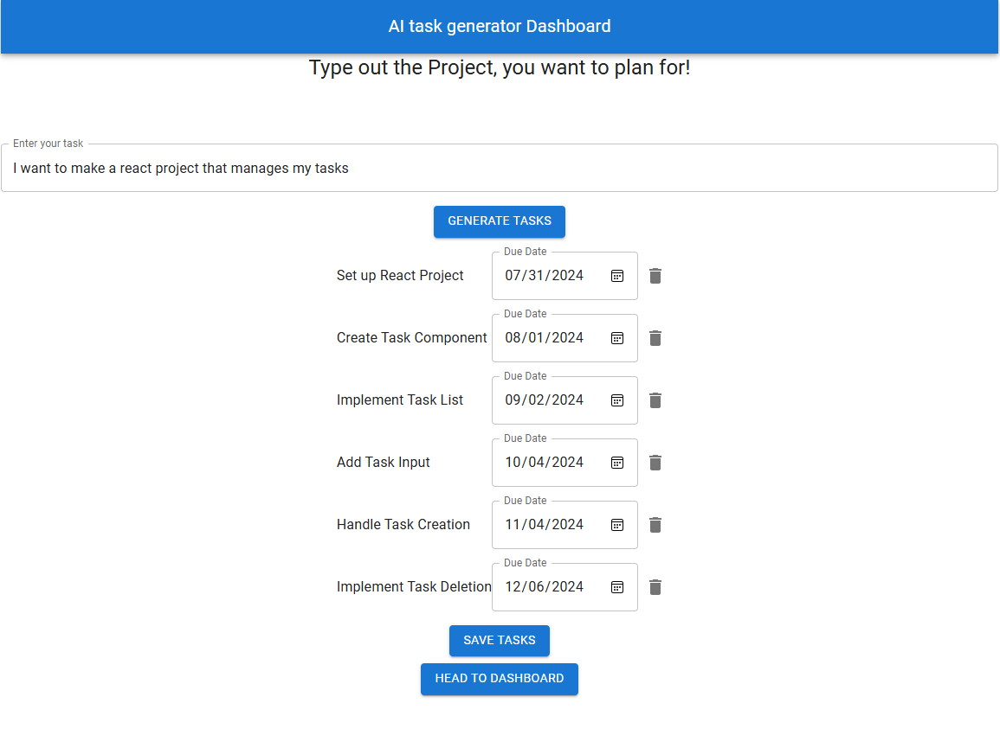

# Taskcally

Taskcally is a task management web application that allows users to create, view, and manage their tasks. Users can manually add tasks or use the AI Todo Maker to generate tasks based on prompts. The application features a weekly view of tasks and allows for easy task completion and deletion.

## Features

- **User Authentication:** Sign up, sign in, and Google authentication.
- **Manual Task Management:** Add, view, complete, and delete tasks.
- **AI Todo Maker:** Generate tasks based on user prompts using the Gemini API.
- **Weekly Task View:** View tasks in a calendar format for the current week.
- **Responsive Design:** Optimized for both desktop and mobile devices.

## Screenshots

### Sign In Page



### Dashboard



### AI Todo Maker



## Installation

### Prerequisites

- Node.js and npm installed on your machine
- MongoDB instance (local or hosted, e.g., MongoDB Atlas)
- Firebase project for authentication
- Vercel account for deployment (optional)

### Setup

1. **Clone the repository:**

   ```sh
   git clone https://github.com/yourusername/taskcally.git
   cd taskcally
   ```

2. **Install server dependencies:**

   ```sh
   cd server
   npm install
   ```

3. **Install client dependencies:**

   ```sh
   cd ../client
   npm install
   ```

4. **Configure environment variables:**

   Create a `.env` file in the `server` directory with the following content:

   ```env
   PORT=3001
   MONGODB_URI=your_mongodb_uri
   API_KEY=your_gemini_api_key
   ```

   Create a `.env` file in the `client` directory with the following content:

   ```env
   REACT_APP_FIREBASE_API_KEY=your_firebase_api_key
   REACT_APP_FIREBASE_AUTH_DOMAIN=your_firebase_auth_domain
   REACT_APP_FIREBASE_PROJECT_ID=your_firebase_project_id
   REACT_APP_FIREBASE_STORAGE_BUCKET=your_firebase_storage_bucket
   REACT_APP_FIREBASE_MESSAGING_SENDER_ID=your_firebase_messaging_sender_id
   REACT_APP_FIREBASE_APP_ID=your_firebase_app_id
   ```

5. **Start the development server:**

   **Server:**

   ```sh
   cd server
   npm start
   ```

   **Client:**

   ```sh
   cd client
   npm start
   ```

6. **Deploy to Vercel (optional):**

   Follow Vercel's deployment instructions to deploy your application.

## Usage

### User Authentication

- **Sign Up:** Create a new account using email and password or sign up with Google.
- **Sign In:** Log in to your account using email and password or sign in with Google.
- **Sign Out:** Log out of your account using the sign-out button in the dashboard.

### Task Management

- **Add Task:** Use the form in the dashboard to add a new task with a title, description, and due date.
- **View Tasks:** View your tasks for the current week in a calendar format.
- **Complete Task:** Click on a task to mark it as complete. Completed tasks are displayed with a strikethrough.
- **Delete Task:** Click the delete icon next to a task to remove it from the list.

### AI Todo Maker

- **Generate Tasks:** Click the "Try Out the AI Todo Maker" button to navigate to the AI Todo Maker component. Enter a prompt and generate tasks.
- **Modify Tasks:** Adjust the due dates and descriptions of generated tasks as needed.
- **Save Tasks:** Save the generated tasks to your task list.

## Technologies Used

- **Frontend:** React, Material-UI
- **Backend:** Node.js, Express.js, MongoDB
- **Authentication:** Firebase
- **AI Integration:** Google Gemini API
- **Deployment:** Vercel

## Contributing

Contributions are welcome! Please fork the repository and submit pull requests for any enhancements or bug fixes.

## License

This project is licensed under the MIT License.

## Contact

For any questions or feedback, please contact atvanvesh@gmail.com.
